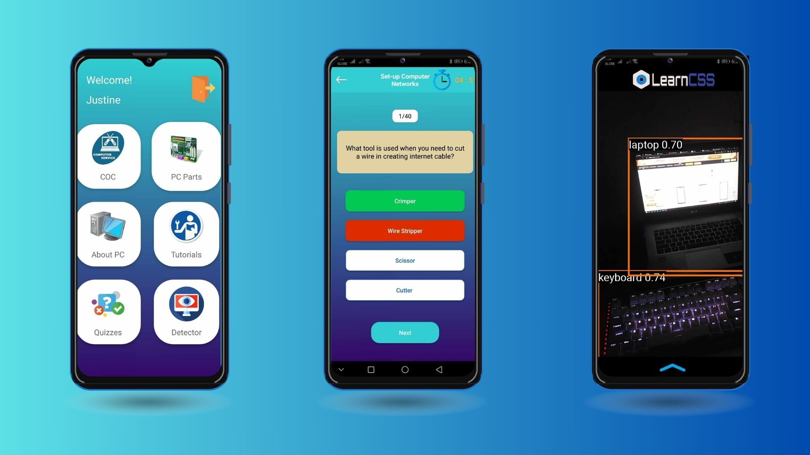

# LearnCSSmobileApp

Crafted using Java, Kotlin, and machine learning in Android Studio. Access informative content, interactive quizzes, captivating 3D visuals, AR, and object detection for an immersive and enriching educational experience for learning computer hardware.

Install directly the "learncss.apk" to use the app.
note that some of the features may not work such as 3d viewer and augmented reality due to outdated version (too lazy to fix).
but here's the whole project :)

go to imagevideosamples to view the system.
